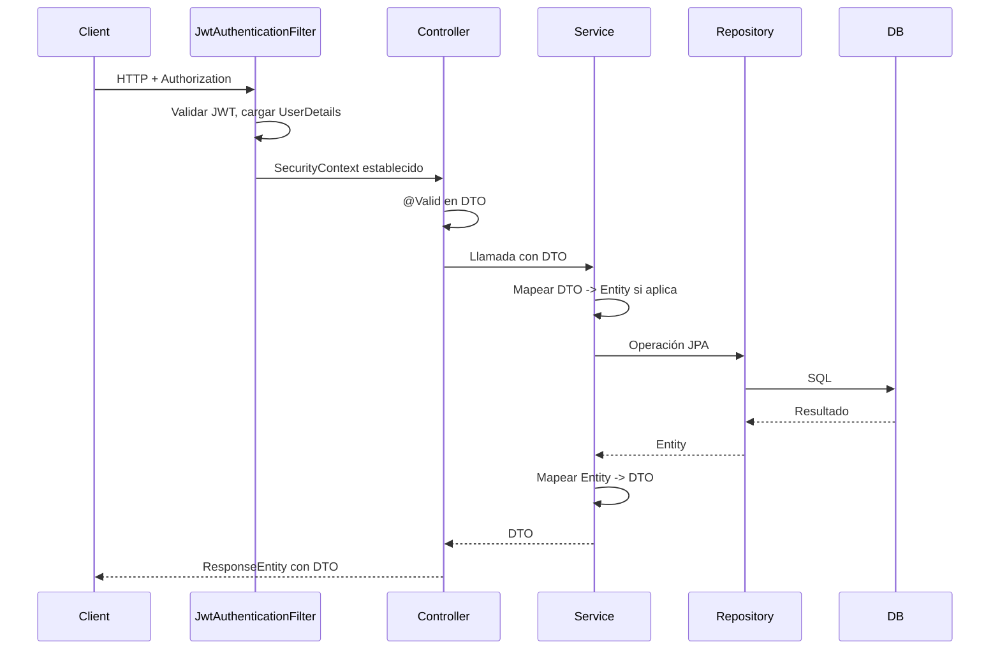

# Arquitectura del backend Candas

Documento de referencia de la arquitectura del backend del proyecto Candas (candas-backend). Sirve como guía para desarrolladores y onboarding.

**Alcance:** backend Java/Spring Boot. Para tecnologías y versiones exactas, ver [TECH-STACK.md](../TECH-STACK.md) (Java 25, Spring Boot 4.0.1, PostgreSQL, jjwt 0.12.5, etc.).

---

## Índice

1. [Estructura de paquetes](#1-estructura-de-paquetes)
2. [Arquitectura en capas y flujo de peticiones](#2-arquitectura-en-capas-y-flujo-de-peticiones)
3. [Seguridad](#3-seguridad)
4. [Configuración y despliegue](#4-configuración-y-despliegue)
5. [Dominio: entidades principales](#5-dominio-entidades-principales)
6. [Manejo de errores](#6-manejo-de-errores)
7. [API y documentación](#7-api-y-documentación)
8. [Documentos relacionados](#8-documentos-relacionados)

---

## 1. Estructura de paquetes

Base: `com.candas.candas_backend` bajo `candas-backend/src/main/java/`.

| Paquete | Contenido |
|---------|-----------|
| **controller** | Controllers REST: Auth, Usuario, Cliente, Agencia, Paquete, Despacho, DespachoMasivo, LoteRecepcion, Saca, Ensacado, ListasEtiquetadas, ManifiestoConsolidado, AtencionPaquete, DestinatarioDirecto, Distribuidor, PuntoOrigen, Rol, Permiso |
| **service** | Lógica de negocio (un servicio por dominio) + JwtService, AuthService |
| **repository** | Interfaces JpaRepository |
| **repository/spec** | Especificaciones JPA (JpaSpecification) para filtros complejos |
| **entity** | Entidades JPA |
| **entity/enums** | Enums de dominio (EstadoPaquete, TipoPaquete, TipoDestino, etc.) |
| **dto** | DTOs de request/response |
| **mapper** | Mapper manual Paquete ↔ PaqueteDTO ([PaqueteMapper](candas-backend/src/main/java/com/candas/candas_backend/mapper/PaqueteMapper.java)) |
| **config** | SecurityConfig, CorsConfig, JwtAuthenticationFilter, JwtAuthenticationEntryPoint, CustomAccessDeniedHandler, SwaggerConfig, DataInitializer, etc. |
| **security** | CustomUserDetailsService, CustomUserDetails |
| **exception** | GlobalExceptionHandler, ApiErrorResponse, ResourceNotFoundException, BadRequestException |
| **util** | PermissionConstants, ExcelHelper, PresintoUtil, etc. |

**Árbol resumido:**

```
com.candas.candas_backend/
├── controller/       # REST controllers
├── service/         # Lógica de negocio
├── repository/      # JpaRepository
│   └── spec/        # JpaSpecification para filtros
├── entity/          # Entidades JPA
│   └── enums/       # Enums de dominio
├── dto/             # Request/Response DTOs
├── mapper/          # PaqueteMapper (Entity ↔ DTO)
├── config/          # Spring Security, CORS, JWT filter, Swagger
├── security/        # UserDetailsService, CustomUserDetails
├── exception/       # GlobalExceptionHandler, ApiErrorResponse
└── util/            # Constantes, helpers
```

**Rutas clave de ejemplo (flujo Cliente):**

- Controller: [ClienteController.java](candas-backend/src/main/java/com/candas/candas_backend/controller/ClienteController.java)
- Service: [ClienteService.java](candas-backend/src/main/java/com/candas/candas_backend/service/ClienteService.java)
- Repository: [ClienteRepository.java](candas-backend/src/main/java/com/candas/candas_backend/repository/ClienteRepository.java)
- Specs: [repository/spec/ClienteSpecs.java](candas-backend/src/main/java/com/candas/candas_backend/repository/spec/ClienteSpecs.java)

---

## 2. Arquitectura en capas y flujo de peticiones

**Patrón:** Controller → Service → Repository. Los controllers solo reciben y devuelven DTOs; no exponen entidades JPA.

- **Validación:** Jakarta Bean Validation en los DTOs de entrada; en los controllers se usa `@Valid` en el cuerpo o parámetros.
- **Mapeo:** El módulo Paquete utiliza [PaqueteMapper](candas-backend/src/main/java/com/candas/candas_backend/mapper/PaqueteMapper.java) (`toEntity`, `updateEntityFromDTO`, `toDTO`). En el resto de módulos el mapeo Entity ↔ DTO se realiza en el service mediante métodos privados.

**Flujo de una petición HTTP:**



---

## 3. Seguridad

- **JWT:** [JwtService](candas-backend/src/main/java/com/candas/candas_backend/service/JwtService.java) (jjwt): generación y validación de tokens. Clave y tiempo de expiración se configuran en `application.properties` (`jwt.secret`, `jwt.expiration`).

- **Filtro:** [JwtAuthenticationFilter](candas-backend/src/main/java/com/candas/candas_backend/config/JwtAuthenticationFilter.java) (extiende `OncePerRequestFilter`): lee la cabecera `Authorization: Bearer <token>`, valida el token con JwtService, obtiene el username, carga `UserDetails` con CustomUserDetailsService y establece el `SecurityContext`.

- **Configuración Spring Security:** [SecurityConfig](candas-backend/src/main/java/com/candas/candas_backend/config/SecurityConfig.java):
  - Sesión **stateless** (sin sesión HTTP).
  - CSRF deshabilitado (API REST con JWT).
  - CORS mediante `CorsConfigurationSource` (CorsConfig).
  - **Endpoints públicos:** `/api/auth/login`, `/api/auth/register`, `/swagger-ui/**`, `/v3/api-docs/**`, `/swagger-ui.html`.
  - Resto de peticiones: `anyRequest().authenticated()`.
  - Control fino con `@PreAuthorize` en controllers (roles y permisos), por ejemplo `hasRole('ADMIN')` o `hasAuthority(PermissionConstants.CLIENTES_READ)`.

- **UserDetails:** [CustomUserDetailsService](candas-backend/src/main/java/com/candas/candas_backend/security/CustomUserDetailsService.java) implementa `UserDetailsService`: carga `Usuario` desde `UsuarioRepository` y construye autoridades (prefijo `ROLE_` para roles y permisos granulares). [CustomUserDetails](candas-backend/src/main/java/com/candas/candas_backend/security/CustomUserDetails.java) es el wrapper que expone usuario y autoridades.

- **Errores de seguridad:**
  - [JwtAuthenticationEntryPoint](candas-backend/src/main/java/com/candas/candas_backend/config/JwtAuthenticationEntryPoint.java): responde 401 (token inválido o expirado) con cuerpo JSON.
  - [CustomAccessDeniedHandler](candas-backend/src/main/java/com/candas/candas_backend/config/CustomAccessDeniedHandler.java): responde 403 cuando el usuario no tiene permisos.

- **Permisos:** Constantes en [PermissionConstants](candas-backend/src/main/java/com/candas/candas_backend/util/PermissionConstants.java). Uso típico en controller: `@PreAuthorize("hasAuthority('CLIENTES_READ')")` o `hasRole('ADMIN')`.

---

## 4. Configuración y despliegue

- **Propiedades:** [application.properties](candas-backend/src/main/resources/application.properties):
  - Aplicación: `spring.application.name=candas-backend`
  - Datasource: PostgreSQL (`spring.datasource.url`, `username`, `password`), con variables de entorno opcionales (`DB_URL`, `DB_USERNAME`, `DB_PASSWORD`)
  - JPA: `ddl-auto`, dialecto PostgreSQL, `show-sql`, `format_sql`
  - Flyway: habilitado, `baseline-on-migrate`, placeholders si aplica
  - JWT: `jwt.secret`, `jwt.expiration`
  - Springdoc: rutas de API docs y Swagger UI

- **CORS:** [CorsConfig](candas-backend/src/main/java/com/candas/candas_backend/config/CorsConfig.java): orígenes permitidos (localhost:5173, localhost:3000, 127.0.0.1:5173, 127.0.0.1:3000), métodos (GET, POST, PUT, DELETE, OPTIONS, PATCH), cabeceras permitidas, `allowCredentials=true`, `maxAge=3600`.

- **Flyway:** Migraciones en [db/migration](candas-backend/src/main/resources/db/migration/); scripts `V*.sql`.

- **Despliegue en producción:** Ver [docs/DEPLOYMENT.md](DEPLOYMENT.md) para build del JAR, variables de entorno y ejecución.

---

## 5. Dominio: entidades principales

| Entidad | Tabla | Responsabilidad |
|---------|--------|------------------|
| Paquete | paquete | Paquete de envío: guía, referencia B2, peso, estado, tipo, remitente/destinatario, agencia/destinatario directo, lote, saca, jerarquía (paquete padre) |
| Cliente | cliente | Cliente (remitente/destinatario): nombre, documento, contacto, dirección |
| Usuario | usuario | Usuario del sistema (UserDetails): username, email, password, roles, agencia asociada |
| Agencia | agencia | Agencia de distribución/destino |
| Despacho | despacho | Despacho (manifiesto) asociado a sacas/paquetes |
| Saca | saca | Saca (agrupación física), vinculada a despacho y paquetes vía PaqueteSaca |
| LoteRecepcion | lote_recepcion | Lote de recepción de paquetes |
| DestinatarioDirecto | destinatario_directo | Destinatario para envío directo |
| Distribuidor | distribuidor | Distribuidor |
| PuntoOrigen | punto_origen | Punto de origen de envíos |
| Rol | rol | Rol de usuario |
| Permiso | permiso | Permiso granular |
| UsuarioRol | usuario_rol | Relación N:M usuario–rol |
| RolPermiso | rol_permiso | Relación N:M rol–permiso |
| AtencionPaquete | atencion_paquete | Atención/incidencias sobre paquetes |
| ManifiestoConsolidado | manifiesto_consolidado | Manifiesto consolidado |
| PaqueteNoEncontrado | paquete_no_encontrado | Registro de paquetes no encontrados |
| PaqueteSaca | paquete_saca | Relación N:M paquete–saca (con orden) |
| DespachoMasivoSesion | despacho_masivo_sesion | Sesión de despacho masivo |
| EnsacadoSesion | ensacado_sesion | Sesión de ensacado |
| TelefonoAgencia | telefono_agencia | Teléfonos de agencia |
| PaqueteSacaId | — | ID compuesto para PaqueteSaca |

**Enums** (en `entity/enums`): EstadoPaquete, TipoPaquete, TipoDestino, EstadoAtencion, TipoProblemaAtencion, EstadoListaEtiqueta, EstadoGuiaEtiqueta, InstruccionGuiaEtiqueta, TipoLote, TamanoSaca.

---

## 6. Manejo de errores

No se utiliza RFC 7807 ProblemDetails. Se usa un DTO propio **[ApiErrorResponse](candas-backend/src/main/java/com/candas/candas_backend/exception/ApiErrorResponse.java)** con:

- `timestamp` (LocalDateTime)
- `status` (int)
- `error` (tipo de error)
- `message` (mensaje principal)
- `errors` (opcional): mapa campo → mensaje para errores de validación

**[GlobalExceptionHandler](candas-backend/src/main/java/com/candas/candas_backend/exception/GlobalExceptionHandler.java)** (`@RestControllerAdvice`) centraliza las excepciones y devuelve `ResponseEntity<ApiErrorResponse>`:

| Excepción | Código HTTP | Descripción |
|-----------|-------------|-------------|
| ResourceNotFoundException | 404 | Recurso no encontrado |
| BadRequestException | 400 | Solicitud inválida |
| IllegalArgumentException | 400 | Solicitud inválida |
| BadCredentialsException | 401 | Usuario o contraseña incorrectos (mensaje genérico) |
| DataIntegrityViolationException | 409 | Conflicto de datos (mensaje sanitizado: duplicados, FK, etc.) |
| MethodArgumentNotValidException | 400 | Error de validación; en `errors` el detalle por campo |
| Exception | 500 | Error interno del servidor |

Excepciones de negocio utilizadas: [ResourceNotFoundException](candas-backend/src/main/java/com/candas/candas_backend/exception/ResourceNotFoundException.java), [BadRequestException](candas-backend/src/main/java/com/candas/candas_backend/exception/BadRequestException.java).

---

## 7. API y documentación

- **Springdoc OpenAPI 2.7:** Swagger UI en `/swagger-ui.html`, documentación OpenAPI en `/v3/api-docs`.

- **[SwaggerConfig](candas-backend/src/main/java/com/candas/candas_backend/config/SwaggerConfig.java):** Configura el bean `OpenAPI` con título "Candas Backend API", versión, descripción, contacto y licencia; define el esquema de seguridad "Bearer Authentication" (JWT) para que en Swagger se pueda enviar el token obtenido de `/api/auth/login`.

---

## 8. Documentos relacionados

- [TECH-STACK.md](../TECH-STACK.md) — Tecnologías y versiones (backend y frontend).
- [docs/DEPLOYMENT.md](DEPLOYMENT.md) — Despliegue en producción (build, variables de entorno).
- [candas-backend/docs/JasperReportsUsage.md](../candas-backend/docs/JasperReportsUsage.md) — Uso de JasperReports para reportes PDF.
