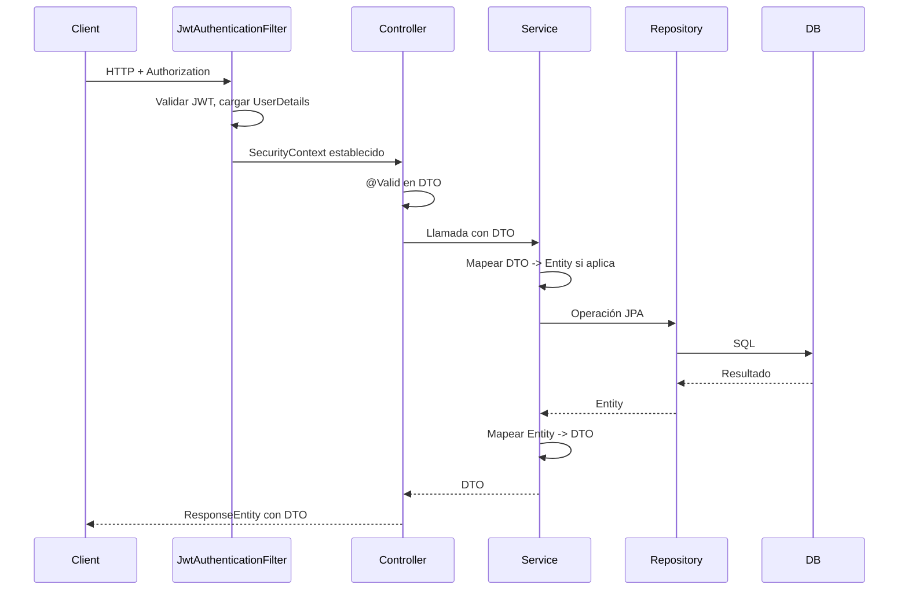

# Arquitectura del backend ECUBOX

Documento de referencia de la arquitectura del backend del proyecto ECUBOX (ecubox-backend). Sirve como guía para desarrolladores y onboarding.

**Alcance:** backend Java/Spring Boot. Para tecnologías y versiones exactas, ver [TECH-STACK.md](TECH-STACK.md) (Java 25, Spring Boot 4.0.3, PostgreSQL, jjwt 0.13.0, etc.).

---

## Índice

1. [Estructura de paquetes](#1-estructura-de-paquetes)
2. [Arquitectura en capas y flujo de peticiones](#2-arquitectura-en-capas-y-flujo-de-peticiones)
3. [Seguridad](#3-seguridad)
4. [Configuración y despliegue](#4-configuración-y-despliegue)
5. [Dominio: entidades principales](#5-dominio-entidades-principales)
6. [Manejo de errores](#6-manejo-de-errores)
7. [API y documentación](#7-api-y-documentación)
8. [Documentos relacionados](#8-documentos-relacionados)

---

## 1. Estructura de paquetes

Base: `com.ecubox.ecubox_backend` bajo `ecubox-backend/src/main/java/`.

| Paquete | Contenido |
|---------|-----------|
| **controller** | Controllers REST: Auth, Usuario, Agencia, Paquete, Despacho, LoteRecepcion, Saca, ManifiestoConsolidado, Distribuidor, AgenciaDistribuidor, Destinatario, Rol, Permiso, Health, ParametrosSistema, etc. |
| **service** | Lógica de negocio (un servicio por dominio) + JwtService, AuthService |
| **repository** | Interfaces JpaRepository |
| **entity** | Entidades JPA |
| **entity/enums** | Enums de dominio (EstadoPaquete, TipoPaquete, etc.) |
| **dto** | DTOs de request/response |
| **config** | SecurityConfig, CorsConfig, JwtAuthenticationFilter, JwtAuthenticationEntryPoint, CustomAccessDeniedHandler, SwaggerConfig, DataInitializer, etc. |
| **security** | CustomUserDetailsService, CustomUserDetails, CurrentUserService |
| **exception** | GlobalExceptionHandler, ApiErrorResponse, ResourceNotFoundException, BadRequestException |
| **util** | PermissionConstants, helpers |

**Árbol resumido:**

```
com.ecubox.ecubox_backend/
├── controller/       # REST controllers
├── service/          # Lógica de negocio
├── repository/       # JpaRepository
├── entity/           # Entidades JPA
│   └── enums/        # Enums de dominio
├── dto/              # Request/Response DTOs
├── config/           # Spring Security, CORS, JWT filter, Swagger
├── security/         # UserDetailsService, CustomUserDetails
├── exception/        # GlobalExceptionHandler, ApiErrorResponse
└── util/             # Constantes, helpers
```

---

## 2. Arquitectura en capas y flujo de peticiones

**Patrón:** Controller → Service → Repository. Los controllers solo reciben y devuelven DTOs; no exponen entidades JPA.

- **Validación:** Jakarta Bean Validation en los DTOs de entrada; en los controllers se usa `@Valid` en el cuerpo o parámetros.
- **Mapeo:** El módulo Paquete utiliza `PaqueteMapper` (`toEntity`, `updateEntityFromDTO`, `toDTO`). En el resto de módulos el mapeo Entity — DTO se realiza en el service mediante métodos privados.

**Flujo de una petición HTTP:**



---

## 3. Seguridad

- **JWT:** `JwtService` (jjwt 0.13.0): generación y validación de tokens. Clave y tiempo de expiración se configuran en `application.properties` (`jwt.secret`, `jwt.expiration`).

- **Filtro:** `JwtAuthenticationFilter` (extiende `OncePerRequestFilter`): lee la cabecera `Authorization: Bearer <token>`, valida el token con JwtService, obtiene el username, carga `UserDetails` con CustomUserDetailsService y establece el `SecurityContext`.

- **Configuración Spring Security:** `SecurityConfig`:
  - Sesión **stateless** (sin sesión HTTP).
  - CSRF deshabilitado (API REST con JWT).
  - CORS mediante `CorsConfigurationSource` (CorsConfig).
  - **Endpoints públicos:** `/api/auth/login`, `/api/auth/register`, `/api/health`, `/swagger-ui/**`, `/v3/api-docs/**`.
  - Resto de peticiones: `anyRequest().authenticated()`.
  - Control fino con `@PreAuthorize` en controllers (roles y permisos).

- **UserDetails:** `CustomUserDetailsService` implementa `UserDetailsService`: carga `Usuario` desde `UsuarioRepository` (busca por username o email) y construye autoridades (prefijo `ROLE_` para roles y permisos granulares).

- **Errores de seguridad:**
  - `JwtAuthenticationEntryPoint`: responde 401 con cuerpo JSON.
  - `CustomAccessDeniedHandler`: responde 403 cuando el usuario no tiene permisos.

- **Permisos:** Constantes en `PermissionConstants`. Uso típico en controller: `@PreAuthorize("hasAuthority('PAQUETES_READ')")`.

---

## 4. Configuración y despliegue

- **Propiedades:** `application.properties`:
  - Aplicación: `spring.application.name=ecubox-backend`
  - Datasource: PostgreSQL con variables de entorno (`DB_URL`, `DB_USERNAME`, `DB_PASSWORD`)
  - JPA: `ddl-auto`, dialecto PostgreSQL
  - Flyway: habilitado, `baseline-on-migrate`
  - JWT: `jwt.secret`, `jwt.expiration`
  - Springdoc: rutas de API docs y Swagger UI

- **Perfiles:**
  - `dev` — valores por defecto para desarrollo local, Swagger habilitado
  - `prod` — todas las variables deben venir del entorno, Swagger desactivado, HSTS habilitado

- **CORS:** `CorsConfig`: orígenes configurables via `CORS_ALLOWED_ORIGINS`, métodos GET/POST/PUT/DELETE/OPTIONS/PATCH, `allowCredentials=true`.

- **Flyway:** Migraciones en `src/main/resources/db/migration/`; 39 scripts `V*.sql`.

- **Despliegue en producción:** Ver [RAILWAY_PRODUCCION_GUIA.md](../despliegue/RAILWAY_PRODUCCION_GUIA.md) para build, variables de entorno y configuración.

---

## 5. Dominio: entidades principales

| Entidad | Tabla | Responsabilidad |
|---------|-------|-----------------|
| Paquete | paquete | Paquete de envío: guía, peso, estado, tipo, remitente/destinatario |
| Usuario | usuario | Usuario del sistema: username, email, password, roles |
| Agencia | agencia | Agencia de distribución/destino |
| AgenciaDistribuidor | agencia_distribuidor | Agencia asociada a un distribuidor |
| Despacho | despacho | Despacho asociado a sacas/paquetes |
| Saca | saca | Agrupación física de paquetes, vinculada a despacho |
| LoteRecepcion | lote_recepcion | Lote de recepción de paquetes |
| Destinatario | destinatario | Destinatario de envíos |
| Distribuidor | distribuidor | Distribuidor |
| Manifiesto | manifiesto_consolidado | Manifiesto consolidado |
| Rol | rol | Rol de usuario |
| Permiso | permiso | Permiso granular |
| TrackingEvent | tracking_event | Eventos de rastreo de paquetes |
| ParametroSistema | parametro_sistema | Parámetros configurables del sistema |

**Enums** (en `entity/enums`): EstadoPaquete, TipoPaquete, TipoDestino, y otros enums de dominio.

---

## 6. Manejo de errores

Se usa un DTO propio `ApiErrorResponse` con:

- `timestamp` (LocalDateTime)
- `status` (int)
- `error` (tipo de error)
- `message` (mensaje principal)
- `errors` (opcional): mapa campo → mensaje para errores de validación

`GlobalExceptionHandler` (`@RestControllerAdvice`) centraliza las excepciones:

| Excepción | Código HTTP | Descripción |
|-----------|-------------|-------------|
| ResourceNotFoundException | 404 | Recurso no encontrado |
| BadRequestException | 400 | Solicitud inválida |
| IllegalArgumentException | 400 | Argumento inválido |
| BadCredentialsException | 401 | Credenciales incorrectas |
| DataIntegrityViolationException | 409 | Conflicto de datos (duplicados, FK) |
| MethodArgumentNotValidException | 400 | Error de validación con detalle por campo |
| Exception | 500 | Error interno del servidor |

---

## 7. API y documentación

- **Springdoc OpenAPI 3.0.2:** Swagger UI en `/swagger-ui.html`, OpenAPI spec en `/v3/api-docs`.
- **SwaggerConfig:** Bean `OpenAPI` con título "ECUBOX Backend API", esquema de seguridad Bearer JWT.

---

## 8. Documentos relacionados

- [TECH-STACK.md](TECH-STACK.md) — Tecnologías y versiones (backend y frontend)
- [RAILWAY_PRODUCCION_GUIA.md](../despliegue/RAILWAY_PRODUCCION_GUIA.md) — Despliegue en producción
- [UX-UI-DESIGN.md](UX-UI-DESIGN.md) — Diseño UX/UI del frontend
