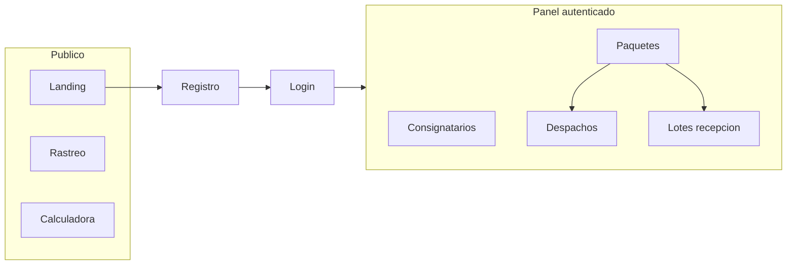

# Manual de usuario ECUBOX

Documento orientado a personas que operan o consultan la plataforma ECUBOX: logística entre Estados Unidos y Ecuador, casillero, registro de paquetes y rastreo para el cliente final.

---

## Tabla de contenidos

1. [Introducción](#1-introducción)
2. [Acceso y roles](#2-acceso-y-roles)
3. [Área pública](#3-área-pública)
4. [Panel operativo y navegación](#4-panel-operativo-y-navegación)
5. [Módulos de operaciones](#5-módulos-de-operaciones)
6. [Catálogos](#6-catálogos)
7. [Administración](#7-administración)
8. [Configuración (vista general)](#8-configuración-vista-general)
9. [Parámetros editables y sistema de estados de rastreo](#9-parámetros-editables-y-sistema-de-estados-de-rastreo)
10. [Soporte y glosario](#10-soporte-y-glosario)

---

## 1. Introducción

**ECUBOX** es un sistema de gestión para acompañar envíos desde USA hacia Ecuador: consolidación tipo casillero, registro de paquetes por consignatario, control operativo (pesaje, lotes, despachos) y **rastreo** para quien recibe el envío.

**Qué puedes hacer según tu perfil**

- Como **cliente o usuario del panel**: dar de alta consignatarios y paquetes, consultar información autorizada y seguir el flujo que tu cuenta permita.
- Como **operario o administrador**: usar módulos de pesaje, despachos, lotes, parámetros y catálogos según los permisos que te asignen.

**Requisitos técnicos**

- Navegador actualizado (Chrome, Edge, Firefox o Safari recientes).
- URL de la aplicación la proporciona tu organización (puede variar entre entornos de prueba y producción).

---

## 2. Acceso y roles

### Registro e inicio de sesión

| Acción | Ruta | Descripción |
|--------|------|-------------|
| Registro | `/registro` | Crear una cuenta de acceso. |
| Inicio de sesión | `/login` | Entrar con usuario y contraseña. |
| Cierre de sesión | Desde el panel | Usa la opción de salir en la interfaz cuando termines (especialmente en equipos compartidos). |

Tras iniciar sesión accedes al **panel** (por ejemplo `/inicio`). La mayoría de rutas del panel exigen estar autenticado.

### Roles y rutas especiales

- **Administrador (`ADMIN`)** y **operario (`OPERARIO`)** pueden usar funciones restringidas, por ejemplo la herramienta **Asignar guía de envío** (integrada en la pantalla de paquetes; la ruta directa `/asignar-guia-envio` también está protegida para estos roles).
- Si intentas abrir una URL sin permiso o sin rol adecuado, la aplicación puede redirigirte al inicio del panel o a login.

### Permisos granulares

El **menú lateral** no muestra las secciones para las que no tienes permiso. Ejemplos de permisos usados en la aplicación:

- `CONSIGNATARIOS_READ` — Consignatarios  
- `PAQUETES_READ`, `PAQUETES_CREATE`, `PAQUETES_UPDATE`, `PAQUETES_DELETE`, `PAQUETES_PESO_WRITE` — Paquetes y pesaje  
- `DESPACHOS_WRITE` — Despachos, lotes de recepción y entrada a **Parámetros** (menú Configuración)  
- `AGENCIAS_READ`, `PUNTOS_ENTREGA_READ`, `COURIERS_ENTREGA_READ`, `MANIFIESTOS_READ` — Catálogos  
- `USUARIOS_READ`, `ROLES_READ`, `PERMISOS_READ` — Administración  
- `ESTADOS_RASTREO_READ`, `ESTADOS_RASTREO_CREATE`, `ESTADOS_RASTREO_UPDATE` — Catálogo de estados en Parámetros  
- `TARIFA_CALCULADORA_READ` — Tarifa en Parámetros  

Si **no ves** una opción que esperabas, suele deberse a tu rol o permisos, no a un fallo de la aplicación. Consulta con un administrador si necesitas más accesos.

---

## 3. Área pública

No requieren iniciar sesión (salvo que tu despliegue añada restricciones adicionales):

| Página | Ruta | Uso |
|--------|------|-----|
| Inicio / landing | `/` | Presentación del servicio, enlaces a registro y calculadora. |
| Rastreo | `/tracking` | Consultar el estado de un envío por **número de guía**. |
| Calculadora | `/calculadora` | Herramienta pública de estimación relacionada con envíos. |

El pie de página enlaza a rastreo, calculadora, inicio de sesión y registro.

---

## 4. Panel operativo y navegación

### Inicio del panel

- Ruta típica: `/inicio`.
- Muestra **accesos rápidos** a Despachos, Paquetes y Lotes de recepción cuando tu cuenta tiene los permisos correspondientes.

### Barra lateral

Agrupación habitual:

| Grupo | Ejemplos de secciones |
|-------|------------------------|
| **Principal** | Inicio, Mi casillero, Mis guías, Mis entregas (cliente) |
| **Operaciones** | Consignatarios, Paquetes, Pesaje, Estados de paquetes, Despachos, Lotes recepción, Envíos consolidados, Guías master |
| **Catálogos** | Agencias, Puntos de entrega, Couriers de entrega, Manifiestos |
| **Administración** | Usuarios, Roles, Permisos |
| **Configuración** | Parámetros |

Puedes **colapsar** la barra y cambiar **tema** (claro / oscuro / sistema). Si está disponible, **Buscar** (atajo `Ctrl+K` o `⌘K`) abre la búsqueda rápida de páginas.

---

## 5. Módulos de operaciones

Orden sugerido según el flujo logístico (las rutas pueden variar ligeramente según permisos):

### Consignatarios (`/consignatarios`)

- **Permiso:** `CONSIGNATARIOS_READ` (y los de alta/edición si aplican).
- Personas finales en Ecuador que reciben los paquetes; suelen asociarse a tus envíos y referencias.

### Paquetes (`/paquetes`)

- **Permiso:** `PAQUETES_READ` como mínimo para listar.
- Registro de nuevos paquetes, edición y búsqueda por guía master, referencia, consignatario, etc.
- **Asignar guía master:** botón visible para **ADMIN** y **OPERARIO**; abre la herramienta para vincular guías master a paquetes en bloque.

### Pesaje (`/pesaje`)

- **Permiso:** `PAQUETES_PESO_WRITE`.
- Registro o actualización del peso (en lbs) de los paquetes según el proceso operativo.

### Estados de paquetes (`/gestionar-estados-paquetes`)

- **Permiso:** en el menú se alinea con operaciones de paquete (p. ej. `PAQUETES_PESO_WRITE`).
- Permite seleccionar paquetes **sin saca/despacho** y aplicar un **cambio de estado** masivo.
- Los estados configurados en **Parámetros → Estados por punto** (registro de paquete, lote de recepción, despacho, tránsito) **no** aparecen como destino manual: los asignan los flujos automáticos correspondientes. Si necesitas otro estado intermedio, elige uno que no esté reservado para esos hitos.

### Despachos (`/despachos`, `/despachos/nuevo`, `/despachos/$id`, editar)

- **Permiso:** `DESPACHOS_WRITE`.
- Creación y seguimiento de despachos, asociación de sacas y paquetes según las reglas del sistema.

### Lotes de recepción (`/lotes-recepcion`, nuevo, detalle)

- **Permiso:** `DESPACHOS_WRITE` (misma entrada de menú que despachos en la configuración actual).
- Registro de recepciones y relación con guías de envío; al **procesar** el lote aplica estados de llegada a aduana y en bodega según **Estados por punto**.

### Envíos consolidados (`/envios-consolidados`)

- **Permiso:** `ENVIOS_CONSOLIDADOS_READ` / `ENVIOS_CONSOLIDADOS_UPDATE`.
- Agrupa paquetes para manifiestos internos. Estado operativo derivado: `VACIO`, `EN_PREPARACION`, `ENVIADO_DESDE_USA`, `RECIBIDO_EN_BODEGA`, `LIQUIDADO`. El pago (`estadoPago`) es independiente.
- Acciones: crear, agregar/quitar paquetes (solo en preparación), **enviar desde USA**, reabrir, **aplicar estado** masivo a piezas, manifiesto PDF/XLSX.

### Guías master (`/guias-master`)

- **Permiso:** `GUIAS_MASTER_READ` y operaciones de escritura según rol.
- Agrupa piezas de un carrier; estado global recalculado (`EN_TRANSITO_USA_ECUADOR`, recepción, despacho, etc.). Estados terminales y `EN_REVISION` quedan congelados.

### Mis guías y Mis entregas (cliente)

- **Mis guías** (`/mis-guias`): seguimiento de guías master del cliente (`MIS_GUIAS_READ`).
- **Mis entregas** (`/mis-entregas`): despachos con las piezas del cliente; puede **confirmar entrega** (`MIS_ENTREGAS_CONFIRM`) cuando el sistema lo habilita.

#### ¿Cómo encuentro el número de guía?

En `Mis guías` (y dentro de **Registrar guías**, con el enlace **«¿No sabes cuál número ingresar?»**) hay una ayuda que explica qué número registrar:

- **Qué es**: el **número de guía** es el **código de rastreo** que aparece cuando la tienda confirma que tu paquete fue **enviado**. No es el número de pedido ni el de factura.
- **Sí es la guía**: «Número de rastreo», «Tracking number», «Tracking ID», «Package tracking».
- **No es la guía**: número de pedido, número de factura, SKU, código del producto, referencia de pago.
- **Dónde aparece**: en el correo de «Pedido enviado / En camino», en el detalle del pedido (sección «Rastrear»/«Seguimiento») o en la confirmación del transportista.
- **Compra dividida**: si la tienda dividió tu compra en **varios paquetes** y muestra varios números de rastreo, **registra cada número como una guía separada**.
- **Ejemplos** (Amazon y SHEIN, ilustrativos; los formatos varían): un código correcto luce como `1Z999AA10123456784` o `TBA123456789000`; un número de pedido como `114-1234567-1234567` **no** sirve como guía.

> Si pegas un número que **parece un número de pedido**, la app muestra un aviso, pero **no te bloquea**: puedes continuar si estás seguro. La validación acepta guías de cualquier transportista (con letras, guiones o distinta longitud).

---

## 6. Catálogos

Rutas típicas y permisos asociados en el menú:

| Sección | Ruta | Permiso de lectura (referencia) |
|---------|------|-----------------------------------|
| Agencias | `/agencias` | `AGENCIAS_READ` |
| Puntos de entrega | `/puntos-entrega` | `PUNTOS_ENTREGA_READ` |
| Couriers de entrega | `/couriers-entrega` | `COURIERS_ENTREGA_READ` |
| Manifiestos | `/manifiestos`, `/manifiestos/$id` | `MANIFIESTOS_READ` |

Sirven para mantener datos maestros que luego usan despachos, entregas y documentación.

---

## 7. Administración

| Sección | Ruta | Contenido |
|---------|------|-----------|
| Usuarios | `/usuarios` | Altas, bajas y datos de acceso (`USUARIOS_READ` y permisos de escritura según rol). |
| Roles | `/roles` | Conjuntos de permisos asignables a usuarios. |
| Permisos | `/permisos` | Listado de permisos disponibles en el sistema. |

Un **rol** agrupa **permisos**; cada **usuario** recibe uno o varios roles. Así se controla qué menús y acciones ve cada persona sin asignar permisos uno a uno manualmente en cada cuenta (salvo excepciones que defina tu administrador).

---

## 8. Configuración (vista general)

### Parámetros del sistema (`/parametros-sistema`)

- Acceso desde el menú **Configuración → Parámetros** (permiso `DESPACHOS_WRITE` en la barra lateral).
- Pantalla unificada con **varias pestañas**: mensajes, tarifa, estados, etc. (detalle en la sección 9).

### Mi casillero (`/casillero`)

- En el grupo **Principal**; muestra la dirección USA del cliente (casillero) y la información institucional o de contacto cargada en la aplicación.

### Tarifa calculadora (`/tarifa-calculadora`)

- Ruta propia del panel para trabajar la tarifa de la calculadora pública.
- Dentro de **Parámetros**, puede mostrarse un módulo relacionado si tu usuario tiene `TARIFA_CALCULADORA_READ` o rol **ADMIN** / **OPERARIO**.

---

## 9. Parámetros editables y sistema de estados de rastreo

### 9.1 Panorama de la pantalla Parámetros

Al abrir **Parámetros** ves primero una **vista de tarjetas** para elegir el módulo. Cada bloque guarda configuración global:

| Pestaña / módulo | Contenido resumido |
|------------------|--------------------|
| **WhatsApp** | Plantilla del mensaje de despacho por WhatsApp; puedes insertar **variables** (por ejemplo datos del despacho o del destinatario) que el sistema sustituye al generar el mensaje. |
| **Mi casillero** | Texto con dirección, horarios u otros datos del casillero USA que debe ver el cliente. |
| **Tarifa** | Valores de la calculadora pública (visible solo con permiso o rol adecuado). |
| **Estados** | Catálogo maestro de **estados de rastreo** (ver 9.2). |
| **Estados por punto** | Qué estado del catálogo se aplica en cada hito automático (ver 9.3). |

Si editas texto en WhatsApp o Mi casillero e intentas **cambiar de pestaña o volver al menú** sin guardar, la aplicación puede pedirte **confirmación** para no perder cambios.

**Quién ve las pestañas de Estados**

- Pueden verse con permiso `ESTADOS_RASTREO_READ` o con rol **ADMIN** u **OPERARIO**.

### 9.2 Catálogo de estados (pestaña «Estados»)

Los **estados de rastreo** describen en qué etapa está un paquete (por ejemplo «En tránsito», «En aduana»). Sirven para:

- La **línea de tiempo** que ve el cliente en **Rastreo** (según visibilidad pública de cada estado).
- Las **transiciones** que aplican operación, lotes y despachos.

**Campos habituales al crear o editar**

- **Código** y **nombre** (obligatorios); el código suele normalizarse en mayúsculas.
- **Orden de tracking** — posición en la secuencia mostrada al público.
- **Tipo de flujo:** **Normal** o **Alterno**. Los estados **alternos** representan situaciones excepcionales (por ejemplo una retención): en la configuración de orden deben quedar **justo después** de un estado **base** que elijas.
- **Leyenda** opcional (puede incluir texto dinámico para días, según lo definido en pantalla).
- **Visible en tracking público** u opciones similares según la interfaz.
- **Activo** — si el estado puede usarse en operaciones nuevas.

**Acciones**

| Acción | Descripción |
|--------|----------------|
| **Crear** | Alta de un estado nuevo (validación de código y nombre). |
| **Editar** | Modificar un estado existente. |
| **Desactivar** | El estado deja de estar disponible para operaciones nuevas; no borra el histórico. El cuadro de confirmación indica que dejará de estar disponible para nuevas operaciones. |
| **Eliminar** | Solo si **ningún paquete** usa ese estado; en caso contrario el sistema lo impedirá (mensaje acorde al backend). |
| **Orden de tracking** | Reordena los estados **base** y define **después de qué base** va cada estado **alterno**. Debes pulsar **Guardar orden tracking** para aplicar los cambios. Este orden afecta cómo se muestra la progresión en rastreo. |

La página pública de ejemplos usa este mismo catálogo en tiempo real. Crear, renombrar,
reordenar, ocultar o desactivar un estado no requiere editar la web pública.

**Permisos de escritura en el catálogo**

- Puedes crear, editar, desactivar, eliminar y guardar orden si tienes `ESTADOS_RASTREO_CREATE` o `ESTADOS_RASTREO_UPDATE`, o si eres **ADMIN** u **OPERARIO** (según la lógica actual de la pantalla).

### 9.3 Estados por punto (pestaña «Estados por punto»)

Aquí eliges **qué estado del catálogo** (o qué etiqueta de guía/consolidado) corresponde a cada **momento automático**. La pantalla agrupa los puntos en **cuatro bloques**:

**Paquetes (IDs de estado de rastreo, obligatorios salvo aviso/confirmación):**

| Campo | Detonador |
|-------|-----------|
| Registro de paquete | Alta en Paquetes |
| Asociar a envío consolidado | Agregar paquete a consolidado |
| En lote de recepción | Procesar lote (bodega) |
| Asociar guía master | Vincular pieza a guía master |
| Salida de origen (USA) | Enviar consolidado desde USA |
| Llegada a destino (aduana) | Procesar lote (primer paso) |
| En despacho | Agregar a despacho/saca |
| En tránsito | Avance masivo por despacho |
| Aviso confirmación entrega | Push al cliente (opcional) |
| Entrega confirmada cliente | Mis entregas (opcional) |
| Inicio / fin cuenta regresiva | Anclas de plazo (opcional) |

**Guías master:** diez selectores con valores del enum `EstadoGuiaMaster` (sin piezas, en espera, tránsito USA-Ecuador, recepción, despacho, cancelada, en revisión, etc.).

**Consolidados:** cuatro etiquetas operativas (`VACIO`, `EN_PREPARACION`, `ENVIADO_DESDE_USA`, `RECIBIDO_EN_BODEGA`, `LIQUIDADO`) para la UI — el backend **deriva** el estado real con la misma lógica.

**Tracking:** anclas de inicio/fin de cuenta regresiva.

Los estados asignados a estos puntos **no** aparecen en **Estados de paquetes** (cambio manual). Ver [Detonadores por estado](DETONADORES_POR_ESTADO.md).

### 9.4 Coherencia con el resto del manual

1. Define el **catálogo** y el **orden** en **Parámetros → Estados**.  
2. Asigna **estados por punto** (paquetes, guías master, consolidados, tracking).  
3. Flujo típico: **Registro** → **Consolidado** (`PLANILLA`) → **Guía master** → **Salida USA** → **Lote** (aduana + bodega) → **Despacho** → **Avance masivo** → **Aviso push** → **Mis entregas** (`ENTREGADO`).

---

## 10. Soporte y glosario

### Soporte

El pie de la web pública incluye enlaces a **Rastreo**, **Calculadora** e **inicio de sesión**. No hay un formulario de soporte genérico en el pie; para incidencias o dudas de cuenta, contacta a tu **administrador ECUBOX** o al canal que te indique tu operador logístico.

### Visión general del flujo

### Lenguaje interno vs. lenguaje del cliente

ECUBOX separa el vocabulario **interno** (operación, back-office, esta documentación) del vocabulario **visible para el cliente**. La operación conserva sus términos técnicos; el cliente ve términos más simples.

| Interno (operación) | Visible para el cliente |
|---|---|
| Guía master / número de guía master | **Guía** / **Número de guía** / **Mis guías** |
| Pieza | **Paquete** |
| Envío consolidado / consolidado | **Envío** (el cliente nunca ve «consolidado») |

**Estados de guía** (parcial y completo comparten una sola etiqueta de cliente; la diferencia se explica con cantidades de paquetes):

| Estado técnico | Etiqueta interna | Etiqueta cliente |
|---|---|---|
| `PENDIENTE_VERIFICACION` | Pendiente de verificación | Pendiente de verificación |
| `VERIFICADA` | Verificada | Guía verificada |
| `EN_REVISION` | En revisión | En revisión |
| `SIN_PAQUETES_REGISTRADOS` | Sin paquetes registrados | Sin paquetes registrados |
| `CON_PAQUETES_REGISTRADOS` | Con paquetes registrados | En preparación |
| `ENVIO_PARCIAL` / `ENVIO_COMPLETO` | Envío parcial / Envío completo | En camino a Ecuador |
| `RECEPCION_PARCIAL` / `RECEPCION_COMPLETA` | Recepción parcial / Recepción completa | En bodega |
| `DESPACHO_PARCIAL` | Despacho parcial | En camino al destino |
| `DESPACHO_COMPLETADO` | Despacho completado | Entregada |
| `CANCELADA` | Cancelada | Cancelada |

> Estas equivalencias se administran solo en código (catálogo compartido `src/lib/estados/guiaMasterEstados.ts`) y se consultan en modo lectura desde **Parámetros del sistema → Estados de rastreo → «Equivalencias de estados para clientes»**.

### Glosario breve

| Término | Significado |
|---------|-------------|
| **Paquete** | Unidad de envío registrada con guía master y, en su caso, peso (lbs) y consignatario. En superficies de cliente, **Pieza** también se presenta como «Paquete». |
| **Guía master / número de guía** | Identificador del envío para rastreo y operación (equivalente al MAWB de la industria courier). Para el cliente se muestra simplemente como **Guía**. |
| **Pieza** | Unidad física que pertenece a una guía master (se enumera como `n/total`). En la vista del cliente se nombra **Paquete**. |
| **Casillero** | Dirección USA asignada al cliente para recibir compras antes de consolidarse y enviarse a Ecuador. |
| **Consignatario** (back-office) / **Destinatario** (vista cliente) | Persona o entidad en destino asociada a los paquetes. |
| **Courier de entrega** | Empresa de paquetería de última milla en Ecuador (Servientrega, Laar, Tramaco, etc.). |
| **Punto de entrega** | Sucursal del courier de entrega donde el consignatario puede retirar su paquete. |
| **Despacho** | Agrupación operativa de envío (sacas, precintos, etc., según tu configuración). |
| **Saca** | Contenedor o agrupación física dentro de un despacho. |
| **Lote de recepción** | Registro de llegada o ingreso de guías desde operación de recepción. |
| **Estado de rastreo** | Etapa del ciclo de vida del paquete en el sistema. |
| **Estado base** | Estado de flujo **normal** que forma la secuencia principal de tracking. |
| **Estado alterno** | Estado excepcional que en la configuración se coloca **después** de un estado base. |
| **Orden de tracking** | Posición del estado en la línea de tiempo pública. |
| **Estado por punto** | Estado asignado automáticamente en cada hito (registro, consolidado, lote, guía master, despacho, confirmación cliente, etc.). |
| **Envío consolidado** | Agrupador interno del operario para manifiestos; no aparece en rastreo público. |
| **Estado operativo consolidado** | Etiqueta derivada (`VACIO` … `LIQUIDADO`); independiente del `estadoPago`. |
| **Confirmación de entrega** | Acción del cliente en Mis entregas que aplica el estado configurado (típicamente `ENTREGADO`). |

---

*Manual generado para la aplicación ECUBOX. Las rutas y permisos reflejan la versión del frontend en el repositorio; ante cambios de versión, puede haber matices en nombres de menú o permisos.*
